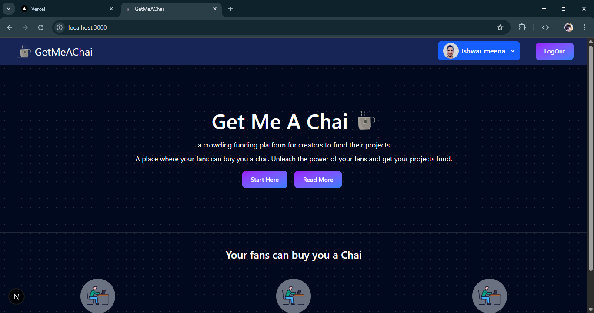

# GetMeAChai



A modern platform to connect chai lovers and local tea vendors. Discover, order, and enjoy your favorite chai from the comfort of your home.

---

## 🚀 Live Demo

[🌐 View Live Project]()

---


## 🛠️ Tech Stack

- **Frontend:** React, Tailwind CSS
- **Backend:** Node.js, Express.js
- **Database:** MongoDB
- **Deployment:** Vercel
- **Authentication:** NextAuth js
---

## 📦 Installation

```bash
git clone https://github.com/ishwar-meena/GetMeAChai.git
cd GetMeAChai
npm install
npm start
```

---


---

## 📄 License

This project is licensed under the [MIT License](LICENSE).

---

> Made with ❤️ for chai enthusiasts.
